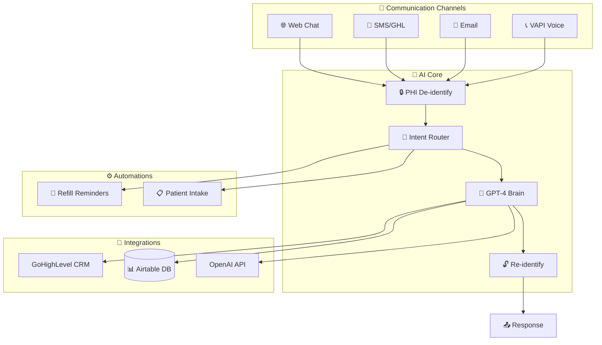

<div align="center">

# 💊 Pharmacy AI Automation System

[](https://python.org)
[](https://fastapi.tiangolo.com)
[](https://openai.com)
[](LICENSE)
[](#-hipaa-compliance)

**A HIPAA-compliant AI automation platform for independent pharmacies specializing in compounded medications.**

*Multi-channel communication • Smart intent routing • Automated workflows • Real-time analytics*

[Features](#-features) • [Quick Start](#-quick-start) • [Architecture](#-architecture) • [API Docs](#-api-endpoints) • [Dashboard](#-dashboard)

</div>

---

## ✨ Features

<table>
<tr>
<td width="50%">

### 🔒 HIPAA-Safe AI Processing
- PHI automatically de-identified before any AI/LLM calls
- Secure re-identification after processing
- Full audit trail logging

</td>
<td width="50%">

### 📱 Multi-Channel Communication
- **Chat Widget** - Website integration
- **SMS** - GoHighLevel webhooks
- **Email** - Smart triage & drafts
- **Voice** - VAPI call agent

</td>
</tr>
<tr>
<td width="50%">

### 🧠 Smart Intent Detection
- AI-powered request classification
- Automatic routing to handlers
- Context-aware responses

</td>
<td width="50%">

### ⏰ Automated Workflows
- **Refill Reminders** - Day 21, 26, 35 sequences
- **Patient Intake** - New patient onboarding
- **Follow-ups** - Smart scheduling

</td>
</tr>
<tr>
<td width="50%">

### 📊 Real-time Analytics
- Daily prescription volume
- Refill performance metrics
- Automation success rates

</td>
<td width="50%">

### 📝 Compliance First
- Draft responses require human review
- No auto-send on patient communications
- Complete audit logging

</td>
</tr>
</table>

---

## 🏗️ Architecture



---

## 🛠️ Tech Stack

| Category | Technology |
|----------|------------|
| **Backend** |    |
| **AI/LLM** |  |
| **CRM** |  |
| **Database** |  |
| **Voice** |  |
| **Frontend** |   |

---

## 🚀 Quick Start

### Prerequisites

- Python 3.9+
- API keys for: OpenAI, GoHighLevel, Airtable, VAPI

### Installation

```bash
# Clone the repository
git clone https://github.com/surbalo1/Pharmacy-AI-automation-system.git
cd Pharmacy-AI-automation-system

# Create virtual environment
python -m venv venv
source venv/bin/activate  # On Windows: venv\Scripts\activate

# Install dependencies
pip install -r requirements.txt

# Configure environment
cp .env.example .env
# Edit .env with your API keys

# Run the server
python main.py
```

### 🌐 Access Points

| Service | URL |
|---------|-----|
| **API Server** | `http://localhost:8000` |
| **Dashboard** | `http://localhost:8000/dashboard` |
| **API Docs** | `http://localhost:8000/docs` |
| **Health Check** | `http://localhost:8000/health` |

---

## 📁 Project Structure

```
Pharmacy-AI-automation-system/
├── 📄 main.py                  # FastAPI entry point
├── ⚙️ config.py                # Settings & environment config
│
├── 🔒 phi/                     # HIPAA-safe data handling
│   ├── deidentify.py           # Strip PHI before AI calls
│   ├── reidentify.py           # Restore PHI after AI response
│   └── models.py               # Data models
│
├── 🧠 brain/                   # Core AI logic
│   ├── router.py               # Intent detection & routing
│   ├── reasoning.py            # AI wrapper with PHI safety
│   └── audit.py                # Compliance logging
│
├── 🔌 handlers/                # API endpoints
│   ├── chat.py                 # Website chat widget
│   ├── sms.py                  # SMS webhooks (GHL)
│   ├── email.py                # Email triage & drafts
│   ├── voice.py                # VAPI call agent
│   └── analytics.py            # Metrics API
│
├── 🌐 integrations/            # External APIs
│   ├── openai_client.py        # OpenAI with retry logic
│   ├── ghl.py                  # GoHighLevel CRM
│   └── airtable.py             # Data warehouse
│
├── ⏰ automations/             # Scheduled workflows
│   ├── refill_reminders.py     # 30-day refill sequences
│   └── intake.py               # New patient onboarding
│
├── 📊 dashboard/               # Analytics UI
│   ├── index.html
│   ├── styles.css
│   └── app.js
│
└── 🧪 tests/                   # Unit tests
```

---

## 📡 API Endpoints

### 💬 Chat

| Method | Endpoint | Description |
|:------:|----------|-------------|
| `POST` | `/api/chat/message` | Send a chat message |
| `GET` | `/api/chat/history/{session_id}` | Get conversation history |

### 📱 SMS

| Method | Endpoint | Description |
|:------:|----------|-------------|
| `POST` | `/api/sms/webhook` | Incoming SMS webhook from GHL |

### 📧 Email

| Method | Endpoint | Description |
|:------:|----------|-------------|
| `POST` | `/api/email/triage` | Triage incoming email |
| `GET` | `/api/email/pending` | Get pending email drafts |

### 📞 Voice

| Method | Endpoint | Description |
|:------:|----------|-------------|
| `POST` | `/api/voice/event` | VAPI call event webhook |
| `GET` | `/api/voice/stats` | Call statistics |

### 📊 Analytics

| Method | Endpoint | Description |
|:------:|----------|-------------|
| `GET` | `/api/analytics/daily` | Today's metrics |
| `GET` | `/api/analytics/prescriptions` | Rx statistics |
| `GET` | `/api/analytics/refills` | Refill performance |
| `GET` | `/api/analytics/open-orders` | Open orders list |

---

## 📊 Dashboard

Access the real-time analytics dashboard at `http://localhost:8000/dashboard`

### Dashboard Features

- 📈 **Daily prescription volume** with trend analysis
- 💊 **Refill reminder performance** tracking
- 🤖 **Automation success rates** (Chat/SMS/Voice)
- 📋 **Open order tracking** and management
- 🏷️ **Compound category breakdown** visualization

---

## ⚙️ Configuration

### Environment Variables

Create a `.env` file with the following:

```bash
# OpenAI
OPENAI_API_KEY=sk-your-key

# GoHighLevel
GHL_API_KEY=your-ghl-key
GHL_LOCATION_ID=your-location-id

# Airtable
AIRTABLE_API_KEY=your-airtable-key
AIRTABLE_BASE_ID=your-base-id

# VAPI
VAPI_API_KEY=your-vapi-key

# App Settings
DEBUG=false
MOCK_MODE=false
```

### 🧪 Mock Mode

For testing without real APIs, set `MOCK_MODE=true` in your `.env` file. The system will return simulated responses for development and testing.

---

## 🔒 HIPAA Compliance

This system is designed with HIPAA requirements in mind:

| Requirement | Implementation |
|-------------|----------------|
| **PHI Protection** | De-identification before any AI/LLM processing |
| **Data Separation** | Re-identification keys stored separately from AI context |
| **Audit Trail** | All actions logged to `logs/audit_log.jsonl` |
| **Human Review** | No auto-send on patient communications |
| **Draft System** | All responses require human approval before sending |

> ⚠️ **Important:** This system is designed to assist with HIPAA compliance but should be reviewed by your compliance officer before production deployment.

---

## 🧪 Testing

```bash
# Run all tests
pytest tests/ -v

# Run specific test file
pytest tests/test_phi.py -v

# Run with coverage
pytest tests/ --cov=. --cov-report=html
```

---

## 🔌 Integration Setup

<details>
<summary><b>📱 GoHighLevel</b></summary>

1. Get API key from **Settings > API**
2. Configure webhook URL: `your-domain.com/api/sms/webhook`
3. Set up automation triggers for inbound messages

</details>

<details>
<summary><b>📊 Airtable</b></summary>

Create the following tables in your base:
- **Patients** - Patient demographics
- **Prescriptions** - Rx records
- **Providers** - Healthcare providers
- **Interactions** - Communication log

</details>

<details>
<summary><b>📞 VAPI</b></summary>

1. Create a VAPI account
2. Configure webhook URL: `your-domain.com/api/voice/event`
3. Set up your voice agent persona

</details>

---

## 🤝 Contributing

Pull requests are welcome! Please ensure:

1. Tests pass (`pytest tests/ -v`)
2. Code follows existing style
3. Include tests for new features

---

## 📄 License

This project is licensed under the MIT License - see the [LICENSE](LICENSE) file for details.

---

<div align="center">

**Built with ❤️ for independent pharmacies**

[](https://github.com/surbalo1/Pharmacy-AI-automation-system)

</div>
