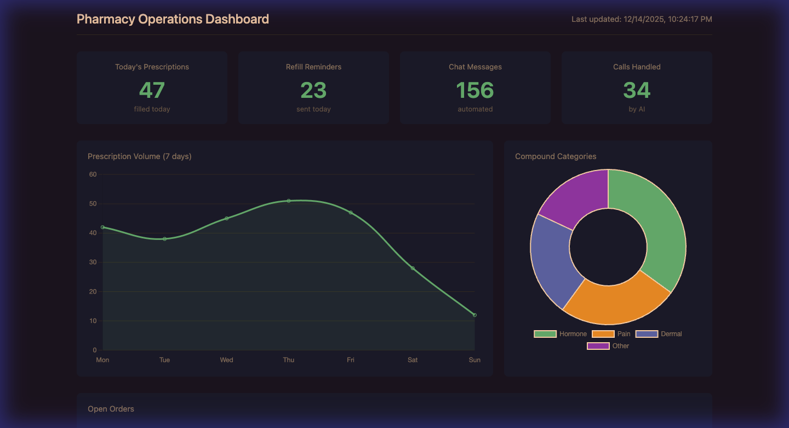

# Pharmacy AI Automation System

A HIPAA-compliant automation platform for independent pharmacies specializing in compounded medications. Built with FastAPI, featuring AI-powered chat, SMS, email triage, voice agents, and automated refill reminders.



## Features

- **PHI De-identification** - Patient data stripped before any AI processing
- **Multi-channel Communication** - Chat, SMS, Email, Voice support
- **Smart Intent Detection** - Routes requests to appropriate handlers
- **Refill Automation** - Day 21, 26, 35 reminder sequences
- **Patient Intake** - Automated new patient onboarding
- **Analytics Dashboard** - Real-time operational metrics
- **Audit Logging** - Full compliance trail

## Tech Stack

- **Backend:** Python 3.9+ / FastAPI
- **AI:** OpenAI GPT-4
- **CRM:** GoHighLevel
- **Database:** Airtable
- **Voice:** VAPI
- **Frontend:** Vanilla JS + Chart.js

## Quick Start

```bash
# clone repo
git clone https://github.com/yourusername/pharmacy-automation.git
cd pharmacy-automation

# install dependencies
pip install -r requirements.txt

# configure environment
cp .env.example .env
# edit .env with your API keys

# run server
python main.py
```

Server starts at `http://localhost:8000`

## Project Structure

```
├── main.py                 # FastAPI entry point
├── config.py               # Settings and env config
├── phi/                    # HIPAA-safe data handling
│   ├── deidentify.py       # Strip PHI before AI calls
│   ├── reidentify.py       # Restore PHI after AI response
│   └── models.py           # Data models
├── brain/                  # Core AI logic
│   ├── router.py           # Intent detection & routing
│   ├── reasoning.py        # AI wrapper with PHI safety
│   └── audit.py            # Compliance logging
├── handlers/               # API endpoints
│   ├── chat.py             # Website chat widget
│   ├── sms.py              # SMS webhooks (GHL)
│   ├── email.py            # Email triage & drafts
│   ├── voice.py            # VAPI call agent
│   └── analytics.py        # Metrics API
├── integrations/           # External APIs
│   ├── openai_client.py    # OpenAI with retry logic
│   ├── ghl.py              # GoHighLevel CRM
│   └── airtable.py         # Data warehouse
├── automations/            # Scheduled workflows
│   ├── refill_reminders.py # 30-day refill sequences
│   └── intake.py           # New patient onboarding
├── dashboard/              # Analytics UI
│   ├── index.html
│   ├── styles.css
│   └── app.js
└── tests/                  # Unit tests
```

## API Endpoints

### Chat
| Method | Endpoint | Description |
|--------|----------|-------------|
| POST | `/api/chat/message` | Send chat message |
| GET | `/api/chat/history/{session_id}` | Get session history |

### SMS
| Method | Endpoint | Description |
|--------|----------|-------------|
| POST | `/api/sms/webhook` | Incoming SMS webhook |

### Email
| Method | Endpoint | Description |
|--------|----------|-------------|
| POST | `/api/email/triage` | Triage incoming email |
| GET | `/api/email/pending` | Get pending emails |

### Voice
| Method | Endpoint | Description |
|--------|----------|-------------|
| POST | `/api/voice/event` | VAPI call events |
| GET | `/api/voice/stats` | Call statistics |

### Analytics
| Method | Endpoint | Description |
|--------|----------|-------------|
| GET | `/api/analytics/daily` | Today's metrics |
| GET | `/api/analytics/prescriptions` | Rx statistics |
| GET | `/api/analytics/refills` | Refill performance |
| GET | `/api/analytics/open-orders` | Open orders list |

## Dashboard

Access the analytics dashboard at `http://localhost:8000/dashboard`

Features:
- Daily prescription volume
- Refill reminder performance
- Chat/SMS/Call automation rates
- Open order tracking
- Compound category breakdown

## Configuration

### Environment Variables

```bash
# OpenAI
OPENAI_API_KEY=sk-your-key

# GoHighLevel
GHL_API_KEY=your-ghl-key
GHL_LOCATION_ID=your-location-id

# Airtable
AIRTABLE_API_KEY=your-airtable-key
AIRTABLE_BASE_ID=your-base-id

# VAPI
VAPI_API_KEY=your-vapi-key

# App Settings
DEBUG=false
MOCK_MODE=false
```

### Mock Mode

For testing without real APIs, set `MOCK_MODE=true` in your `.env` file. The system will return simulated responses.

## HIPAA Compliance

This system is designed with HIPAA requirements in mind:

- PHI is de-identified before any AI/LLM calls
- Re-identification keys stored separately from AI context
- All actions logged to `logs/audit_log.jsonl`
- No auto-send on patient communications
- Draft responses require human review

## Testing

```bash
# run all tests
pytest tests/ -v

# run specific test file
pytest tests/test_phi.py -v
```

## Integrations Setup

### GoHighLevel
1. Get API key from Settings > API
2. Configure webhook URL: `your-domain.com/api/sms/webhook`

### Airtable
Required tables:
- Patients
- Prescriptions
- Providers
- Interactions

### VAPI
Configure webhook URL: `your-domain.com/api/voice/event`

## License

MIT

## Contributing

Pull requests welcome. Please ensure tests pass before submitting.
